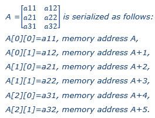

===== Multidimensional Variables
An array variable is a data structure consisting of a collection of variables, each identified by an array index. A variable may have a constant number of dimensions. Each dimension has a size. A size may either be a constant or a structural parameter. Both may use a serialized start value.

The numbering of dimensions is done from left to right and from top to bottom.

  Note:
  For a C API: array[dim1][dim2]…[dimN], where N ∈ N. +
  For XML: document order.

Serialization example

