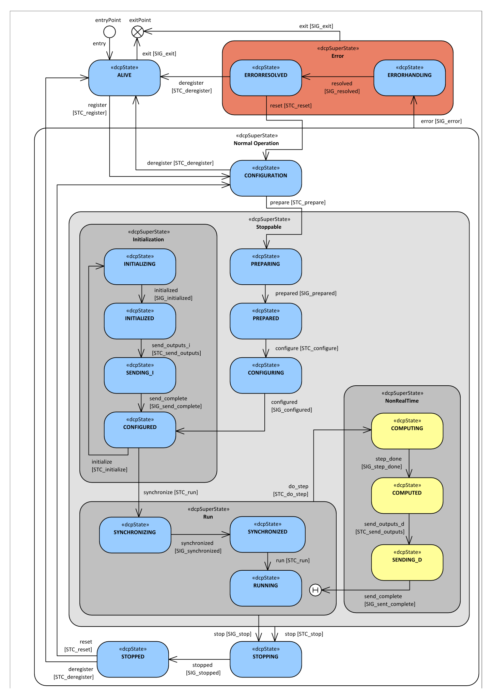

==== Description
The state machine’s entry point is labelled with +entryPoint+, whereas its exit point is labelled with +exitPoint+. If the software component implementing the DCP is not yet loaded, the DCP slave does not exist yet. After unloading the software component implementing the DCP, the DCP slave does not exist anymore.

.DCP slave state machine

