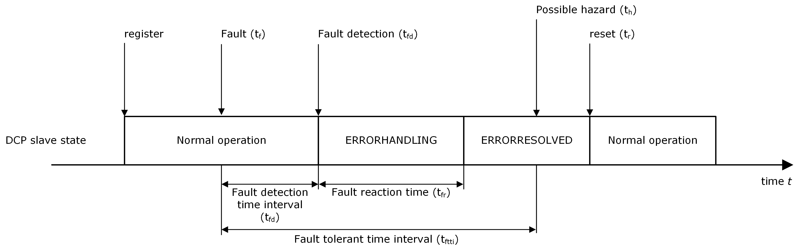

===== Available communication medium
In the following the procedure of error handling is described under the assumption that it is still possible to exchange PDUs.

.Error handling procedure for available communication medium
[width="100%", cols="1,5", options="header"]
|===
|Sequence Number
|Action

|1
|A fault (faulty behavior or condition in model or RT system) occurs within a DCP slave (time tf). After the DCP slave detected this fault (time tfd) it transitions self-reliantly to the Error superstate. +
Note: The transition to +ERRORHANDLING+ is not requested from the master.

|2
|The DCP slave transitions to the +ERRORHANDLING+ state immediately.

|3
|Within the +ERRORHANDLING+ state, the DCP slave tries to send an +NTF_state_changed+ to the master. Then it starts suitable error handling routines and tries to resolve the error. +
Note: Appropriate measures of error resolving are shutdown of subsystems, potential energy dissipation in connected RT systems, etc. This may take some time.

|4a
|If successful, the DCP slave transitions to +ERRORRESOLVED+ state immediately.

Note: No request to do so from master.

The DCP slave either sends a PDU +NTF_state_changed+ to its master, reporting that the state transition is finished, or reports the state change to the master on request.

Note: As defined in communication pattern.

|4b
|If not successful, the system experiences an unrecoverable error. The transition to state +ERRORRESOLVED+ is not performed. Signal SIG_exit to shut down in terms of an error handling procedure may be called.

|5
|In state ERRORRESOLVED, the DCP slave receives a PDU +STC_reset+ (time tr). It acknowledges it by sending a PDU +RSP_ack+ to the DCP master.

|6
|The transition to state +CONFIGURATION+, of superstate Normal operation is performed. Either a PDU +NTF_state_changed+ is sent to the master or the state change is reported to the master on request.
|===

.Procedure for error handling

