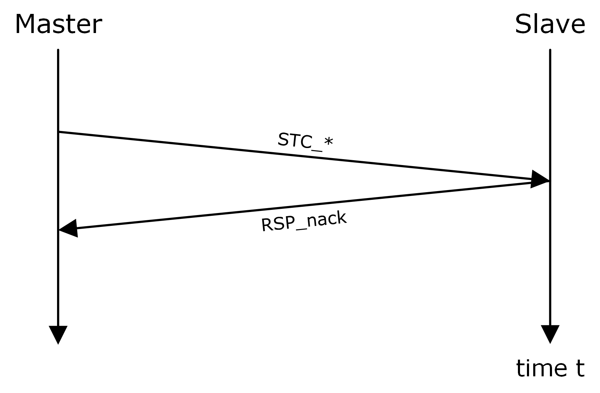
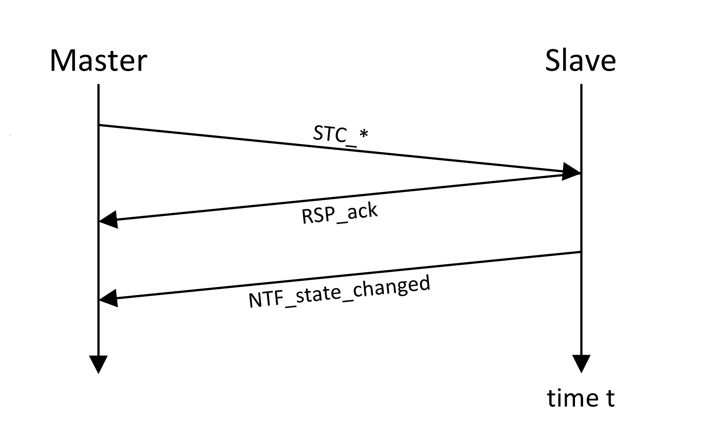

==== State Transition Pattern

In order to operate the DCP state machine, the following state transition pattern is introduced. It is valid for the entire state machine, unless noted otherwise.

.State transition pattern procedure
[width="100%", cols="2,3", options= "header"]
|===
|Sequence Number
|Action

|1
|The DCP master requests a state transition by sending a state change request PDU to the DCP slave.

|2a
|The DCP slave responds to the DCP master by sending +PDU RSP_nack+. In that case, the DCP slave did not receive the request properly or will not be able to fulfill the request properly (see Figure 2).

|2b
|The DCP slave responds by sending PDU +RSP_ack+. In that case, the DCP slave will start the transitioning process immediately.

|3
|If the transition is successfully finished, the DCP slave informs the DCP master by sending a PDU +NTF_state_changed+ (see Figure 3).

|===

.State transition pattern (NAck)

.State transition pattern (Ack)

