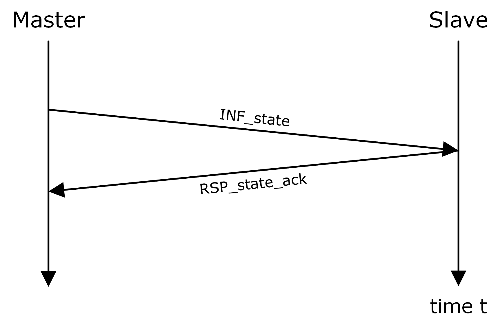

==== State reporting
A DCP slave must communicate its state to its master as soon as it has changed. It does so by sending the PDU +NTF_state_changed+ whenever a DCP slave’s state change is finished.

In addition to that, the PDU +INF_state+ can be sent at any time by the DCP master to query a DCP slave’s state. A DCP slave shall respond with PDU +RSP_state_ack+.

.Positive state request

NOTE: The master is free to choose the DCP slave id before registering DCP slaves, to have a unique identifier for a specific DCP slave at the beginning. The slave must an-swer using exactly this DCP slave id.

NOTE: A DCP slave may be identified using the pdu_seq_id only, with the risk of hav-ing collisions, depending on the underlying communication medium. Using the DCP slave id as described here, it is possible to uniquely identify a DCP slave.
