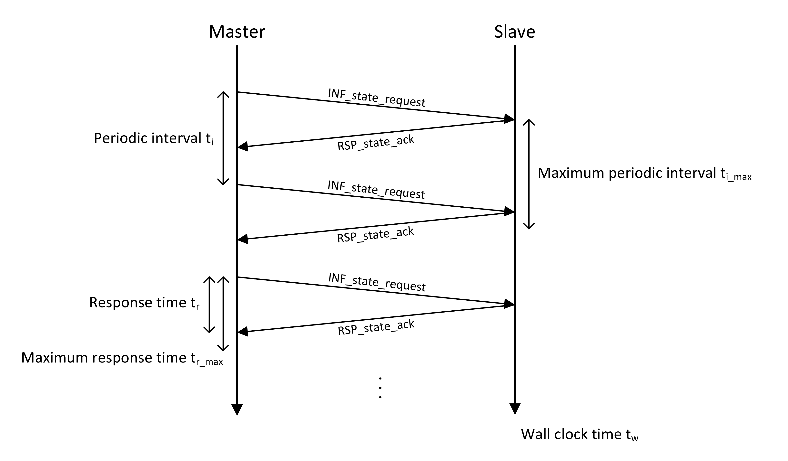

===== Master Monitoring
Each slave must respond with a PDU +RSP_state_ack+ immediately. A timeout defined in the DCP slave description determines the maximum waiting time +ti_~max~+ between two PDUs +INF_state+. If the timeout expires, the slave shall go to state +ERRORHANDLING+ and subsequently to state +ERRORRESOLVED+.

.Heartbeat functionality

