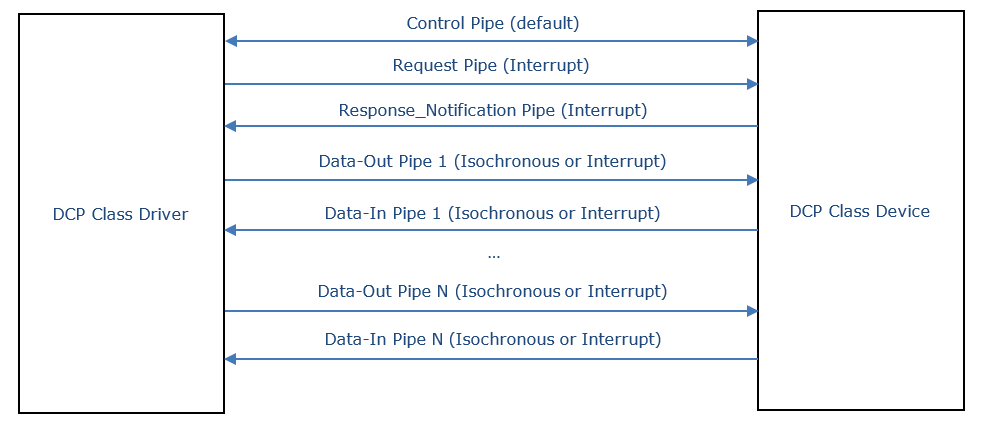

==== General
A DCP master must be implemented on the USB host side, whereas a DCP slave must be imple-mented as a USB device. A DCP slave using USB is accessible through the slave uuid. The USB host driver for DCP must manage the mapping between slave uuid & DCP slave id and assigned USB number.

.USB scheme

The DCP protocol for USB is defined by the DCP class. Every DCP class device consists of the following pipes:

*	The Control Pipe is used for receiving and responding to requests for USB control and class data.

*	The Request Pipe is used for receiving Request PDUs from the master.

*	The Response_Notification Pipe is used for sending Response and Notification PDUs to the master.

*	A Data-Out pipe is used to receive Data from other slaves or from the master.

*	A Data-In pipe is used to send DAT_input_output to other slaves or to the master.

*	A vendor can define multiple Data-Out and Data-In pipes. There must be at least one Da-ta-In pipe if there exists at least one output variable at the DCP slave. There must be at least one Data-Out pipe if there exists at least one input variable or parameter at the DCP slave.
