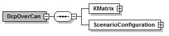

==== DCP over CAN
Figure 8 shows the DCP over CAN root element.

.DcpOverCAN root element

.DcpOverCan element
[width="100%", cols="2,4", options="header"]
|===
|Element name
|Description

|KMatrix
|Contains all elements to describe the messages & signals of the CAN bus and the participation of the bus members to the messages.

|ScenarioConfiguration
|Contains all elements to describe the co-simulation scenario, which would be distributed over configuration PDUs in a native DCP transport protocol for each DCP slave. In addition it contains the name, DCP id & uuid. Which element belongs to which DCP slave can be determined using the uuid.
|===
