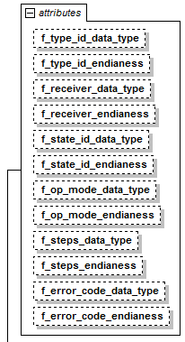
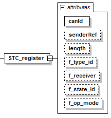
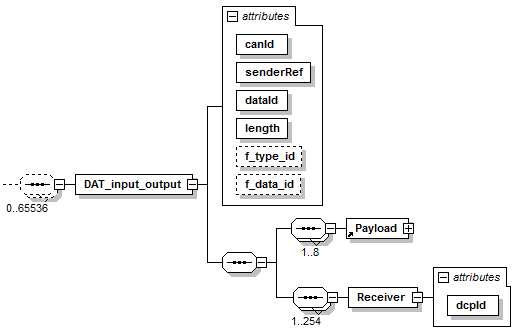
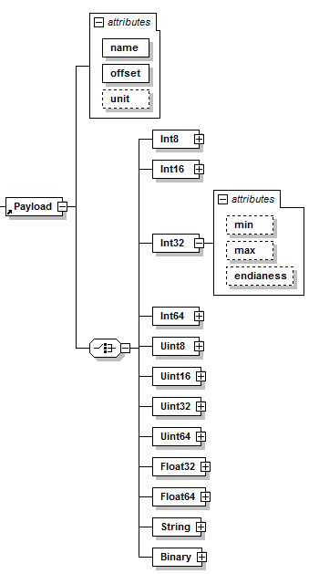

==== Definition of KMatrix
The element +KMatrix+ is specified as follows. The +KMatrix+ element consist optional of the +CAN+ message description all state change, information, notification & response PDUs , as well as an arbitrary number of +CAN+ messages for +DAT_input_output+ & +DAT_parameter+ PDUs. Each state change, information, notification or response PDU is defined in the following way.

.KMatrix element attributes

.KMatrix element attributes
[width="100%", cols="1,3", options="header"]
|===
|Attribute name
|Description

|f_<field_name>_data_type
|The data type of the field <field_name> as integer (see 3.1.10 for corresponding data type).

|f_<field_name>_endianness
|The endianness of the field <field_name>. “little” means little endian, “big” means big endian.
|===

.Attributes of every state change, information, notification & response PDU
[width="100%", cols="1,3", options="header"]
|===
|Attribute name
|Description

|canId
|The CAN identifier in the header of the CAN message

|senderRef
|The DCP id of the sending DCP slave. For state change & information PDUs this is fix, because only the master (DCP id = 0) can send this PDU.

|length
|The length of the CAN payload field.

|f_<field_name>
|The starting byte of <field_name> in the CAN payload. “H” means that this field is not contained in the CAN payload and its value can be determined by the CAN identifier in the header.
|===

.STC_register PDU

The element +DAT_input_output+ consists of up to eight Payload and up to 254 Receiver ele-ments. It is defined as follows:

.DAT_input_output element

.DAT_input_output element attributes
[width="100%", cols="1,3", options="header"]
|===
|Attribute name
|Description

|canId
|The CAN identifier in the header of the CAN message.

|senderRef
|The DCP id of the sending DCP slave.

|dataId
|The data id of the DAT_input_output PDU.

|length
|The length of the CAN payload field.

|f_<field_name>
|The starting byte of <field_name> in the CAN payload. “H” means that this field is not contained in the CAN payload and its value can be determined by the CAN identifier in the header.

|dcpId
|The DCP id of the DCP slave which receives this CAN message.
|===

In +DAT_input_output+, the +Payload+ element contains the definition of one output from the send-ing DCP slave. The choice of the Payload element defines the data type of the output. Payload is defined as follows:

.Payload element

.Payload element attributes
[width="100%", cols="1,3", options="header"]
|===
|Attribute name
|Description

|name
|The name of the output.

|offset
|The starting byte of the output in the CAN payload. +
Note: This is not equal to the position in the CFG_output PDU.

|unit
|The unit of the send output.

|min
|The minimum of the output

|max
|The maximum of the output.

|endianness
|The endianness of the output. “little” means little endian, “big” means big endian.
|===

The element +DAT_parameter+ consists of up to eight Payload and up to 254 receiver elements. It is defined as follows.

.DAT_input_output element

.Attributes of DAT_parameter
[width="100%", cols="1,3", options="header"]
|===
|Attribute name
|Description

|canId
|The CAN identifier in the header of the CAN message.

|senderRef
|The DCP id of the sending DCP slave.

|paramId
|The parameter id of the DAT_parameter PDU.

|length
|The length of the CAN payload field.

|f_<field_name>
|The starting byte of <field_name> in the CAN payload. “H” means that this field is not contained in the CAN payload and its value can be determined by the CAN identifier in the header.

|dcpId
|The DCP id of the DCP slave which receives this CAN message.

|===
