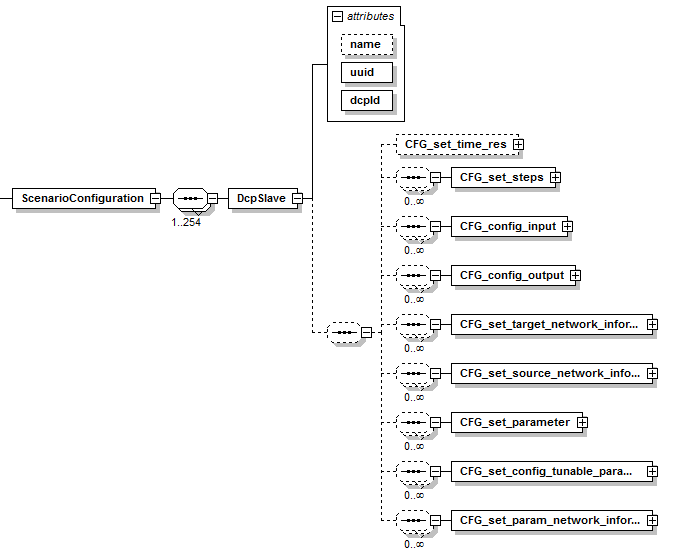

==== Definition of the Scenario Configuration
The element +ScenarioConfiguration+ is defined as follows:

.ScenarioConfiguration element

.Attributes of ScenarioConfiguration and subsequent elements
[width="100%", cols="1,3", options="header"]
|===
|Attribute name
|Description

|name
|The name of the DCP slave.

|uuid
|The uuid of the DCP slave.

|dcpId
|The DCP id of the DCP slave.

|All other attributes
|See section 3.4 for further description.
|===
