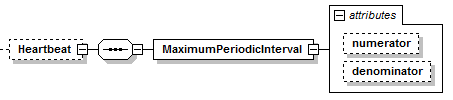

=== Definition of Heartbeat Element
The optional Heartbeat element is specified as follows. It contains a single +MaximumPeriodicInterval+ element with 2 attributes.

.Heartbeat element

.Heartbeat element attributes
[width="100%", cols="1,3", options="header"]
|===
|Attribute name
|Description

|numerator
|Optional attribute of unsigned integer data type. Its default value is 1.

|denominator
|Optional attribute of unsigned integer data type. Its default value is 1.
|===
