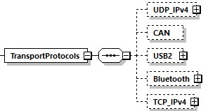

==== General
The DCP supports multiple transport protocols. The TransportProtocols element is used to store specific settings.

.Transport protocols element

Each transport protocol listed under the +TransportProtocol+s element may define a +maxPduSize+ attribute, as required.

[width="100%", cols="1,3", options="header"]
|===
|Attribute name
|Description

|maxPduSize
|Optional attribute of unsigned integer data type, specifying the maximum permissible size a transport protocol can handle.
|===
