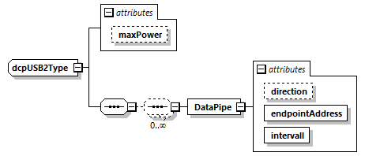

==== USB
The elements and attributes for USB are defined in Table 168.
.USB element attributes
[width=100%, cols="3,5", options="header"]
|===
|Attribute name
|Description

|maxPower
|Optional attribute of unsignedByte data type.
|===
The USB element contains an optional list of DataPipe elements, having the attributes defined in Table 169.

.DataPipe element attributes
[width=100%, cols="3,5", options="header"]
|===
|Attribute name
|Description

|direction
|Optional attribute of string data type, enumerated with either “In” or “Out”.

|endpointAddress
|Attribute of unsignedByte data type. Its value must be greater than 2.

|interval
|Attribute of unsignedByte data type.
|===

.USB2 type definition

