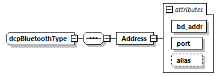

==== Bluetooth
The elements and attributes for Bluetooth are shown in Figure 26 and defined as follows.

.Bluetooth type definition

The attributes of the Address element are specified in Table 170.

.Address element attributes
[width=100%, cols="3,5", options="header"]
|===
|Attribute name
|Description

|bd_addr
|Attribute of String data type. Its value must comply with the following regular expression: +
([0-9A-Fa-f]{2}[:-]){5}([0-9A-Fa-f]{2})

|port
|Attribute of unsignedByte data type. +
Its value is specified to be larger or equal to 1, and smaller or equal to 30.

|alias
|Optional attribute of type normalizedString.

|===
