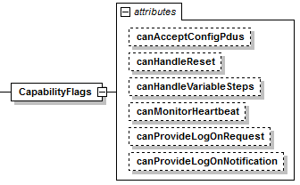

=== Definition of CapabilityFlags Element
The element +CapabilityFlags+ is defined as follows.

.Capability flag element and attributes

The following capability flags are defined to indicate the availability of specific functionality. Each capability flag is of data type bool.

.Capability flags
[width=100%, cols="3,5", options="header"]
|===
|Attribute name
|Description

|canAcceptConfigPdus
|Indicates that a DCP slave is able to process CFG_input, CFG_output, CFG_target_network_information, and CFG_source_network_information PDUs properly. Otherwise, (1) the DCP slaves addressing needs to be resolved in a different way, e.g. manually, and (2) DAT_input_output PDUs need to be configured in a different way, e.g. manually.

|canHandleReset
|The DCP slave can handle a STC_reset PDU and reset the state machine from STOPPED to CONFIGURATION and from ERRORRESOLVED to CONFIGURATION. Otherwise it waits for STC_deregister to transition to ALIVE.

|canHandleVariableSteps
|Indicates that the DCP slave can handle variable steps in NRT operating mode.

|canMonitorHeartbeat
|Indicates that a DCP slave is able to monitor a periodic heartbeat signal sent by a DCP master.
If this capability flag is set to true, the element Heartbeat according to section 5.10 is required.

|canProvideLogOnNotification
|Indicates that the DCP slave supports logging using notifications.

|anProvideLogOnRequest
|Indicates that the DCP slave supports logging using the request-response mechanism.
|===
