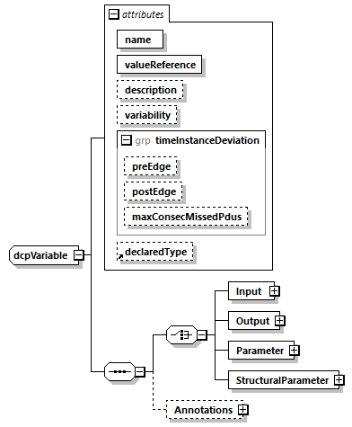

==== Definition of Variable Element
A +Variable+ may be either an Input, an Output, a Parameter, or a +StructuralParameter+. Figure 28 shows the structure of sub-elements and attributes, as defined by the dcpVariable type.

.dcpVariable type

.Variable elements
[width=100%, cols="3,5", options="header"]
|===
|Element
|Description

|Input
|Inputs of the DCP slave.

|Output
|Outputs of the DCP slave.

|Parameter
|Parameters of the DCP slave.

|StructuralParameter
|Structural parameters of the DCP slave.

|Annotations
|dcpAnnotation type, see section 5.8.
|===
