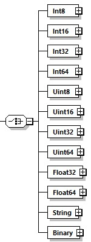

==== Definition of Variable Data Types and Attributes
Inputs, Outputs, Parameters, and +StructuralParameters+ must be assigned a data type. This is indicated by a corresponding subelement representing a DCP data type, as defined in section 5.7.2. Table 174 shows these relationships.

.Data type elements
[width="100%", cols="3,3", options="header"]
|===
|Element
|Data type ID~hex~

|Int8
|0x4

|Int16
|0x5

|Int32
|0x6

|Int64
|0x7

|Uint8
|0x0

|Uint16
|0x1

|Uint32
|0x2

|Uint64
|0x3

|Float32
|0x8

|Float64
|0x9

|String
|0xA

|Binary
|0xB
|===

.Data types of variables

