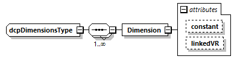
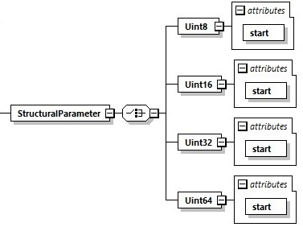

==== Definition of Multi-Dimensional Data Types

In order to define vector and array data types, the dimensions element is a child element of +DcpVariable+. It is defined using +dcpDimensionsType+, which must have at least one Dimension child element. The Dimension element must have one out of two attributes, either constant or +linkedVR+. This is shown in Figure 31.

.Dimension type definition

Table 179 explains the attributes in detail.

.Dependency element attributes
[width=100%, cols="3,5", options="header"]
|===
|Attribute
|Description

|constant
|This is an unsigned long data type attribute, indicating the constant dimension size of a variable.

|linkedVR
|This is an unsigned long data type attribute, referring to a variable identified through its value reference.

|===
Figure 32 shows the structural parameter element. It defines four unsigned integer data types (data type id 0 to 3). Its attributes are given in Table 180.

.Structural parameter element.

.Structural parameter element attributes
[width=100%, cols="3,5", options="header"]
|===
|Attribute
|Description

|start
|The start value of the structural parameter variable.

|===
