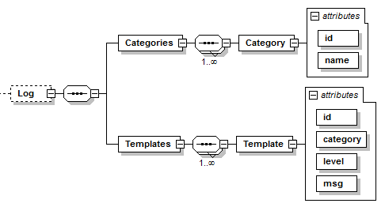

=== Definition of Log Element
For a detailed description of the log mechanisms see section 3.1.23.

.Log Element

.Category element attributes
[width=100%, cols="3,5", options="header"]
|===
|Attribute
|Description

|id
|This defines a log category identifier. Its data type is uint8.

|name
|This defines a name for the log category.

|===

.Template element attributes
[width=100%, cols="3,5", options="header"]
|===
|Attribute
|Description

|id
|This defines a log template identifier. Its data type is uint8.

|category
|This defines a reference to the log category identifier. Its data type is uint8.

|level
|This defines the log level. Its data type is uint8.

|msg
a|This defines the log message. Its data type is a string, where placeholders starting with “%” followed by the corresponding data type descriptor are used. It is possible to escape “%” by using “%%”.

NOTE: Example: Log message "Initialization at %float32 %%." will result in "Initialization at 35.5 %."

|===
