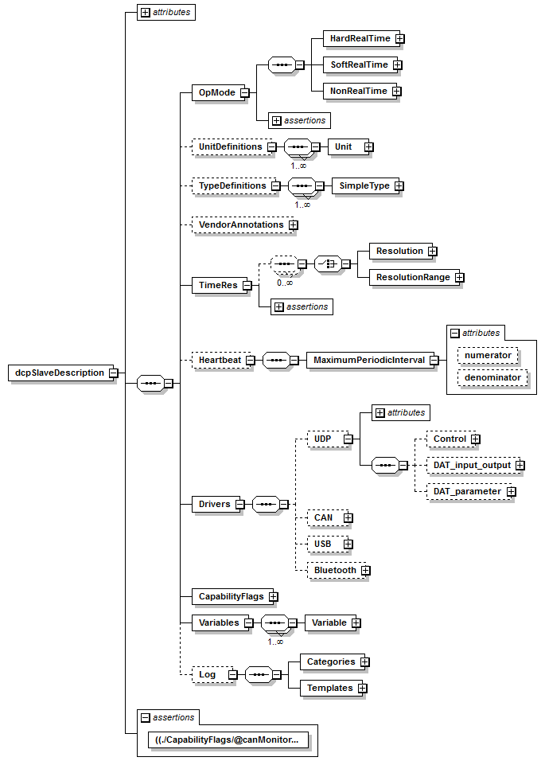
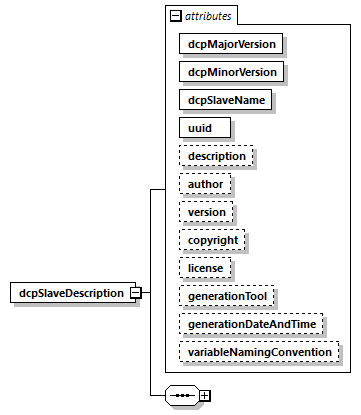

=== Definition of dcpSlaveDescription Element

This is the root level schema file and contains the following definition (the figure below shows all elements in the schema file. Data is defined as attributes to these elements, not shown in this figure).

.DCP slave description root level XSD schema

On the top level, the schema consists of the following elements.

.DCP slave description root level elements
[width="100%", cols="1,3", options="header"]
|===
|Element name
|Description

|OpMode
|Valid operating modes of the described DCP slave.

|UnitDefinitions
|A global list of unit and display unit definitions (see section 5.6).

|TypeDefinitions
|A global list of type definitions.

|VendorAnnotations
|Additional vendor specific data. May be ignored.

|TimeRes
|A list of permissible single time resolutions and resolution ranges.

|Heartbeat
|If present, the DCP slave uses the given settings to monitor a heartbeat signal provided by the DCP master.

|TransportProtocols
|This element contains information for all available DCP slave DCP drivers.

|CapabilityFlags
|The attributes under this element indicate a DCP slave’s capabilities.

|Variables
|The central DCP slave data structure defining all variables of the DCP slave that are visible/accessible via DCP.

|Log
|This element contains categories and templates for logging.

|===

The XML attributes of +dcpSlaveDescription+ are as follows.

.dcpSlaveDescription element attributes

.dcpSlaveDescription element attributes
[width="100%", cols="1,3", options="header"]
|===
|Attribute name
|Description

|dcpMajorVersion
|The DCP major version that was used to generate the DCPX file and accompanying DCP slave. See section 3.1.2.

|dcpMinorVersion
|The DCP minor version that was used to generate the DCPX file and accompanying DCP slave. See section 3.1.2.

|dcpSlaveName
|The name of the complete DCP slave.

|uuid
|The universally unique identifier is a string that is used to uniquely identify a DCP slave in a global environment. The uuid acts as a fingerprint of relevant information. Typically, the uuid is assigned when the DCP slave description file is generated. It is used for verification during the registration process of a DCP slave.

|description
|Optional string that contains a brief description of the complete DCP slave.

|author
|Optional string that contains name and organization of the DCP slave author.

|version
|Optional development version number of the DCP slave.

|copyright
|Optional information on the intellectual property copyright for this DCP slave.

|license
|Optional information on the intellectual property licensing for this DCP slave.

|generationTool
|Optional information about the tool the DCPX file was generated with.

|generationDateAndTime
|Optional date and time when the DCPX file was generated. The format is a subset of “xs:dateTime” and should be: “YYYY-MM-DDThh:mm:ssZ" (with one “T” between date and time; “Z” characterizes the Zulu time zone, in other words Greenwich meantime).

|variableNamingConvention
|Defines whether the variable names in Variables/Variable/name and in TypeDefinitions/SimpleType/name follow a particular convention. Available options are: +
flat: A string (the default). +
structured: Names including “.” as hierarchy separator. +
See section 3.1.18.1 for details.

|===
