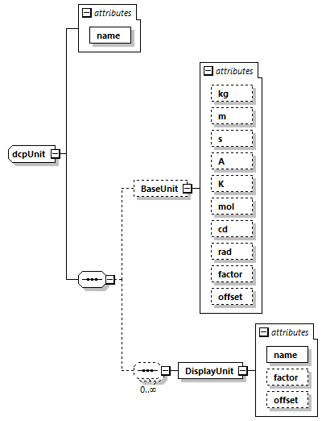

=== Definition of UnitDefinitions Element
NOTE: This definition of units corresponds with the definition of units in FMI 2.0 [9]. This section recapitulates the most important definitions for completeness. For exam-ples and the full definitions, see the FMI 2.0 specification document.

The +dcpUnit+ type is specified as shown in Figure 18. If the UnitDefinitions element is present, it contains one or more Unit elements.

.dcpUnit Type

.dcpUnit element attributes
[width="100%", cols="1,3", options="header"]
|===
|Element name
|Description

|name
|A name of String data type.
|===

The Unit element contains one BaseUnit element, having the attributes defined in Table 161.

.Base unit element attributes
[width="100%", cols="1,3", options="header"]
|===
|Attribute name
|Description

|kg
|Optional attribute of integer data type. Its default value is zero.

|m
|Optional attribute of integer data type. Its default value is zero.

|s
|Optional attribute of integer data type. Its default value is zero.

|A
|Optional attribute of integer data type. Its default value is zero.

|K
|Optional attribute of integer data type. Its default value is zero.

|mol
|Optional attribute of integer data type. Its default value is zero.

|cd
|Optional attribute of integer data type. Its default value is zero.

|rad
|Optional attribute of integer data type. Its default value is zero.

|factor
|Optional attribute of double data type. Its default value is 1.0.

|offset
|Optional attribute of double data type. Its default value is 0.0.

|===

A value with respect to Unit (abbreviated as “Unit_value”) is converted with respect to BaseUnit
(abbreviated as “BaseUnit_value”) using the equation:

              BaseUnit_value = factor * Unit_value + offset

The Unit element contains an optional DisplayUnit element. It contains the attributes as defined in Table 162.

.DisplayUnit element attributes
[width="100%", cols="1,3", options="header"]
|===
|Attribute name
|Description

|name
|Attribute of normalizedString data type.

|factor
|Optional attribute of double data type. Its default value is 1.0.

|offset
|Optional attribute of double data type. Its default value is 0.0.
|===
