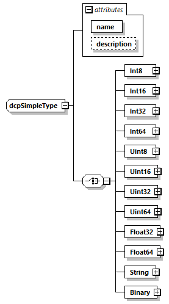

==== General
The TypeDefinitions element is defined as follows.

.dcpSimpleType type

The optional +TypeDefinitions+ element includes a list of +SimpleType+ elements of type +dcpSimpleType+ having the list of attributes defined in Table 163.

.dcpSimpleType element attributes
[width="100%", cols="1,3", options="header"]
|===
|Attribute name
|Description

|name
|Name of this simple type.

|description
|An optional description.

|===
