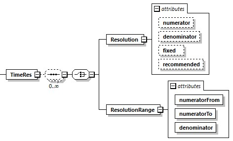

=== Definition of TimeRes Element

The element +TimeRes+ is specified as follows.

.Time resolution element

The +TimeRes+ element contains +Resolution+ or +ResolutionRange+ child elements. Their attributes are described as follows.

.Time resolution attributes
[width="100%", cols="1,3", options="header"]
|===
|Attribute name
|Description

|numerator
|Optional numerator value specified as unsigned integer data type. Its default value is 1.

|denominator
|Optional denominator value specified as unsigned integer data type. Its default value is 1000.

|fixed
|Optional attribute of boolean data type. Its default value is true. If the fixed value is true, then there can only be one single resolution specified.

|recommended
|Optional attribute of boolean data type. If the recommended value is true, then this single resolution value is recommended for simulation. Multiple recommended single resolution values are possible.

|numeratorFrom
|This attribute specifies the begin of a numerator resolution range. Its data type is unsigned integer.

|numeratorTo
|This attribute specifies the end of a numerator resolution range. Its data type is unsigned integer.

|denominator
|This attribute specifies the denominator for one resolution range. Its data type is unsigned integer.
|===

The number of resolutions specified having the attribute fixed set to true is limited to one. In this case, it must be the only resolution specified, and the number of ResolutionRange elements must be zero. Alternatively, a number of +Resolution+ elements having the attribute fixed set to false may be specified.
