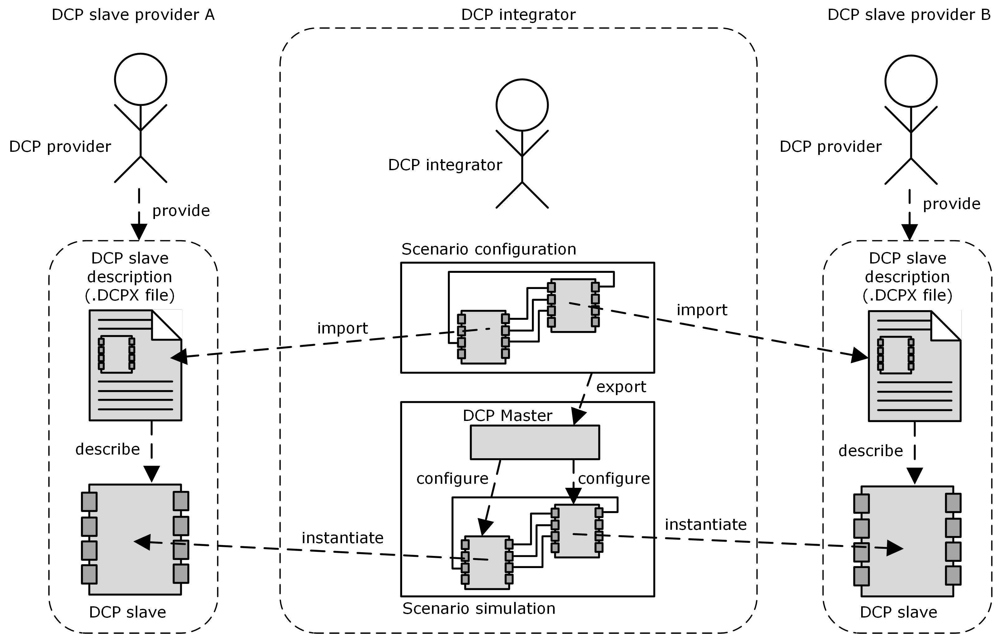

=== B. Default DCP Slave Integration
The following Figure 34 sketches the procedure for default DCP slave integration using the native DCP specification. A DCP slave provider ships a DCP slave description in DCPX file format and a DCP slave to the DCP integrator. The DCP integrator uses the DCP slave description for configura-tion of a scenario. This scenario description is exported to a DCP master. The DCP master is an implementation being able to control DCP slaves. It generates a configuration for simulation and rolls out this configuration to the running instances of the DCP slaves. Then the scenario may be simulated.

NOTE: This specification covers the intended behavior of a DCP slave and the DCP slave description. This specification does not cover the import process of DCP slave descriptions, the generation of a valid scenario configuration, the scenario description being exported to the DCP master, the exact steps necessary for DCP slave instantiation, as well as DCP slave implementation details.

.Default DCP slave integration

