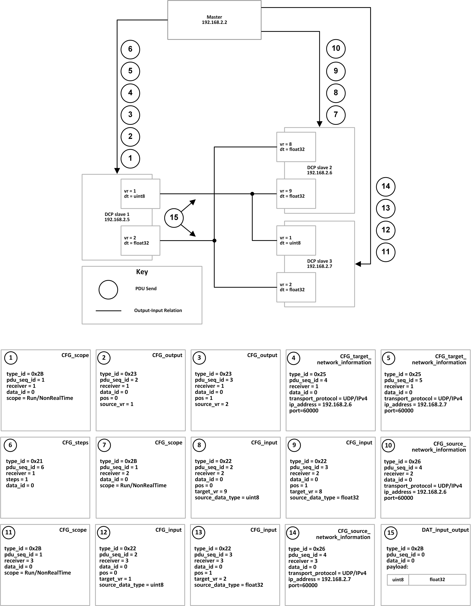

=== D. Example: Data Exchange
The following Figure 35 shows an example of necessary steps for configuration roll-out using na-tive DCP (UDP over IPv4).

.Example configuration roll-out

NOTE: For better legibility all values are in human readable format. On the communication medium these values are transported as defined in this specification.
